# ❄️ Snowflake Streams & Tasks

This document explains how **Streams** and **Tasks** work in Snowflake and how they enable incremental, reliable data processing after Snowpipe ingestion (Bronze → Silver → Gold).

---

## 🚀 Big Picture

Typical modern Snowflake pipeline:

1. **Snowpipe** loads raw files from **S3 / ADLS / GCS** into **Bronze tables**.
2. **Streams** track *only the new or changed rows* on those tables.
3. **Tasks** run on a schedule or in sequence to read from Streams and write into **Silver** and **Gold** tables.

---

## 🔹 Streams

### What is a Stream?

A **Stream** is a *change-tracking object* on top of a table, view, or external table.  
It records DML changes and exposes them as a table-like object so you can query **only new or changed rows** since the last time the stream was consumed.

Key ideas:

- Maintains an internal **offset** (bookmark of last processed change).
- Returns only **unconsumed** changes.
- Once consumed in a transaction (e.g., `MERGE`), those rows will **not** appear again.

```sql
CREATE OR REPLACE STREAM s_bronze_orders
ON TABLE bronze_orders;
```

---

### Types of Streams in Snowflake

There are three main behaviors you’ll see:

| Type | Tracks | Works On | Typical Use Case |
|------|--------|----------|------------------|
| **Standard Stream** | INSERT, UPDATE, DELETE | Tables | Full CDC when upstream can change existing rows |
| **Append-Only Stream** | INSERT only | Tables | Append-only raw data (logs, events, transactions) |
| **Insert-Only Stream on Views / External Tables** | INSERT only | Views, External Tables | Incremental read when underlying source is append-only or immutable |

#### 1️⃣ Standard Stream

- Tracks **INSERT / UPDATE / DELETE**.
- For an UPDATE, you see **two rows** in the stream:
  - One `DELETE` row (old version).
  - One `INSERT` row (new version).

```sql
CREATE OR REPLACE STREAM st_orders_cdc
ON TABLE bronze_orders;  -- standard stream (default)
```

#### 2️⃣ Append-Only Stream

- Tracks **only new rows** (INSERTs).
- Ignores updates and deletes.
- Lighter and faster when your Bronze layer is strictly append-only.

```sql
CREATE OR REPLACE STREAM st_orders_append
ON TABLE bronze_orders
APPEND_ONLY = TRUE;
```

#### 3️⃣ Streams on Views / External Tables (Insert Only)

- You can create streams on **views** or **external tables**.
- Snowflake can’t track in-place updates/deletes on external files, so behaviour is **insert-only**.
- Great for incremental logic defined as a view (e.g. joins, filters on Bronze).

```sql
CREATE OR REPLACE STREAM st_orders_view
ON VIEW v_bronze_orders_clean;
```

---

### Stream Metadata Columns

Every stream row comes with metadata that tells you *what happened*:

| Column | Description |
|--------|-------------|
| `METADATA$ACTION` | `'INSERT'` or `'DELETE'` |
| `METADATA$ISUPDATE` | `TRUE` if this row is part of an UPDATE |
| `METADATA$ROW_ID` | Unique ID of the row version |
| `METADATA$CREATED_ON` | Timestamp when change was captured |

**How to interpret `ACTION` + `ISUPDATE`:**

| Scenario      | `METADATA$ACTION` | `METADATA$ISUPDATE` | Meaning                        |
|---------------|-------------------|---------------------|--------------------------------|
| New row       | `INSERT`          | `FALSE`             | Plain insert                   |
| Delete row    | `DELETE`          | `FALSE`             | Plain delete                   |
| Update (old)  | `DELETE`          | `TRUE`              | Old version of updated row     |
| Update (new)  | `INSERT`          | `TRUE`              | New version of updated row     |

So:

- You **can** tell which rows were inserted, deleted, or updated.
- For updates, you see *two records* and use `ISUPDATE` to group them.

---

### Example: Using a Stream in a MERGE

```sql
MERGE INTO silver_orders AS s
USING (
  SELECT
    order_id,
    customer_id,
    amount,
    order_date,
    METADATA$ACTION      AS action,
    METADATA$ISUPDATE    AS is_update
  FROM st_orders_cdc
) AS d
ON s.order_id = d.order_id

WHEN MATCHED AND d.action = 'DELETE' AND d.is_update = FALSE THEN
  -- hard delete case
  DELETE

WHEN MATCHED AND d.action = 'DELETE' AND d.is_update = TRUE THEN
  -- optional: handle 'before update' image (often ignored)
  UPDATE SET s.is_active = FALSE

WHEN MATCHED AND d.action = 'INSERT' AND d.is_update = TRUE THEN
  -- 'after update' image
  UPDATE SET
    s.customer_id = d.customer_id,
    s.amount      = d.amount,
    s.order_date  = d.order_date

WHEN NOT MATCHED AND d.action = 'INSERT' AND d.is_update = FALSE THEN
  INSERT (order_id, customer_id, amount, order_date)
  VALUES (d.order_id, d.customer_id, d.amount, d.order_date);
```

---

## 🔹 Offset

**Offset** is the internal bookmark that says:

> “Up to which change have I already delivered rows from this stream?”

When you read from a stream (e.g., via `MERGE`):

- Snowflake returns rows **after the last offset**.
- After the transaction commits, the offset moves forward.
- Those changes will **not** be returned again.

### Because of the offset, you get:

- ✅ No **duplicate processing** of the same change  
- ✅ No **reloading the same CDC events**  
- ✅ No **reprocessing old changes**  
- ✅ Less chance of **data inconsistencies** across Bronze, Silver, Gold layers  
- ✅ Pipelines are naturally **incremental only**

---

## 🔹 Stale Streams

A **stale** stream means the stream’s offset is no longer valid because the **table’s data retention window expired**.

- Streams rely on **Time Travel** + **data retention** to compute changes.
- If you don’t consume the stream for too long, the historical versions of rows are purged.
- Then Snowflake can’t reconstruct the change history → stream becomes **STALE**.

> ❗ **Important:** “Stale” is **not** a column in the stream.  
> It is a **status of the stream object**, not part of row metadata.

### Detecting staleness

```sql
SHOW STREAMS;
```

Look at the `STALE` column.

### Fixing a stale stream

- Recreate the stream (starts tracking from *now*):

```sql
CREATE OR REPLACE STREAM st_orders_cdc
ON TABLE bronze_orders;
```

- Or avoid staleness by increasing table retention:

```sql
ALTER TABLE bronze_orders
SET DATA_RETENTION_TIME_IN_DAYS = 7;
```

### Preventing staleness

- Consume streams regularly using **Tasks**.
- Ensure **task schedule** < **data retention window**.
- Monitor via `SHOW STREAMS` and `ACCOUNT_USAGE.STREAMS`.

---

## 🔹 Tasks

### What is a Task?

A **Task** is Snowflake’s built-in **scheduler/orchestrator**, similar to a cron job.

A Task:

- Runs **one SQL statement** (DML / `CALL` / `COPY INTO` / etc.).
- Can run:
  - On a **schedule** (`USING CRON` or simple interval).
  - Or **after another task** (dependency DAG).
- Uses compute from:
  - A specified **WAREHOUSE**, or  
  - **Serverless task compute** (user task managed warehouse), if configured.

---

### Do Tasks need a dedicated Warehouse?

- Every Task needs **some compute**, but:
  - It does **not** need its **own dedicated warehouse**.
- Common patterns:
  - Several ETL tasks share one `ETL_WH`.
  - BI queries use another `BI_WH`.
  - Give heavy, critical tasks their own warehouse only when you need **isolation**.

```sql
CREATE OR REPLACE TASK t_bronze_to_silver
  WAREHOUSE = etl_wh
  SCHEDULE  = 'USING CRON 0/5 * * * * UTC'
AS
MERGE INTO silver_orders ...;
```

You can also use **serverless** (no warehouse in the task) if account settings allow it.

---

### Can a Task run multiple queries?

A Task body can contain **only one statement**.

❌ Not allowed:

```sql
CREATE TASK bad_task
  WAREHOUSE = etl_wh
  SCHEDULE = 'USING CRON 0/5 * * * * UTC'
AS
INSERT INTO t1 ...;
INSERT INTO t2 ...;      -- ❌ multiple separate statements
```

✅ How to run multiple steps:

#### Option A – Call a stored procedure

```sql
CREATE OR REPLACE PROCEDURE sp_full_etl()
RETURNS STRING
LANGUAGE SQL
AS
$$
BEGIN
  -- Step 1
  MERGE INTO silver_orders ...;

  -- Step 2
  INSERT INTO silver_audit_log ...;

  -- Step 3
  INSERT INTO gold_orders ...;

  RETURN 'OK';
END;
$$;

CREATE OR REPLACE TASK t_etl
  WAREHOUSE = etl_wh
  SCHEDULE  = 'USING CRON 0/10 * * * * UTC'
AS
CALL sp_full_etl();
```

#### Option B – Chain multiple tasks

Each Task does one step; tasks are linked with `AFTER`:

```sql
CREATE OR REPLACE TASK t1_bronze_to_silver
  WAREHOUSE = etl_wh
  SCHEDULE  = 'USING CRON 0/10 * * * * UTC'
AS
MERGE INTO silver_orders ...;

CREATE OR REPLACE TASK t2_silver_to_gold
  WAREHOUSE = etl_wh
  AFTER t1_bronze_to_silver
AS
INSERT INTO gold_orders
SELECT ... FROM silver_orders;

CREATE OR REPLACE TASK t3_gold_to_report
  WAREHOUSE = etl_wh
  AFTER t2_silver_to_gold
AS
INSERT INTO report_table
SELECT ... FROM gold_orders;

ALTER TASK t1_bronze_to_silver RESUME;
ALTER TASK t2_silver_to_gold  RESUME;
ALTER TASK t3_gold_to_report  RESUME;
```

Mermaid view of the chain:

```mermaid
flowchart LR
    T1["Task T1: Bronze → Silver"]
    T2["Task T2: Silver → Gold"]
    T3["Task T3: Gold → Report"]

    T1 --> T2 --> T3
```



---

### What happens if a Task is still running when the next scheduled time comes?

Snowflake **does not run overlapping instances** of the same task.

- If run time is every **1 minute**, but a run takes **3 minutes**:
  - 08:49 run starts.
  - 08:50 tick: task still running → **08:50 run is skipped**.
  - 08:51 tick: if still running → skipped again.
  - First tick after task finishes will start the next run.

There is **no queue or backlog** of missed schedule times.

> **Rule:** If a task is **busy** at its scheduled time, that occurrence is **skipped**, not queued.

---

## 🔹 Example: Bulk Load + Streams + Tasks

### 1) Bulk Load Flow (S3 / Blob → Stage → COPY INTO → Table)


- Files land in S3 / Blob / GCS.
- `COPY INTO` (bulk load or Snowpipe internal operation) loads them into a **Bronze table**.
- Data is stored as micro-partitions in **Snowflake managed storage**.
- Load history is tracked in **ACCOUNT_USAGE** views.

---

### 2) Bronze → Silver → Gold with Stream + Task

```mermaid
flowchart LR
    BR["Bronze Table (Snowpipe / COPY INTO)"] --> ST["Stream on Bronze"]
    ST --> T1["Task T1: Bronze → Silver"]
    T1 --> SV["Silver Table"]
    SV --> T2["Task T2: Silver → Gold"]
    T2 --> GD["Gold Table"]
    GD --> REP["Reports / Dashboards / BI"]
```



- Stream gives **incremental changes** from Bronze.
- Tasks consume the stream and populate Silver & Gold at regular intervals.
- Thanks to **offset**, each change is processed **once** and not duplicated.

---

## ✅ Best Practices Recap

- Use **append-only streams** when upstream is strictly append-only.
- Use **standard streams** when you must handle updates and deletes.
- Always consume streams **before** table retention expires to avoid **stale**.
- Use **Tasks** with:
  - A shared ETL warehouse **or**
  - Serverless tasks (if enabled).
- For multiple steps:
  - Either call a **stored procedure** from a single task, or
  - Chain **multiple tasks** with `AFTER`.
- Remember: tasks **skip** schedules when they are still running—no overlapping runs.

---

## 🧠 Summary Table

| Concept | Short Definition |
|--------|-------------------|
| **Stream** | Tracks table/view/external table changes as incremental rows |
| **Standard Stream** | Full CDC: INSERT, UPDATE, DELETE (with metadata) |
| **Append-Only Stream** | Tracks only new inserts |
| **Offset** | Bookmark of last consumed change in a stream |
| **Stale Stream** | Stream lost ability to compute changes because retention expired |
| **Task** | Snowflake’s built-in scheduler / orchestrator (cron-like) |
| **Task Chain** | Sequential execution using `AFTER` (T1 → T2 → T3) |
